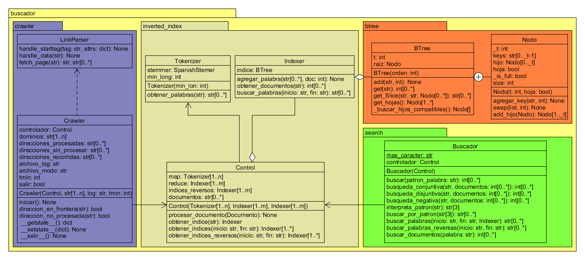

# edd-tp2
Buscador Web en Python

## Diagrama de Clases

## Requisitos
Para correr la aplicación es necesario instalar la librería
[`nltk`](http://www.nltk.org/) de python. Correr como administrador:

    pip install nltk

En modo consola de Python, correr:

    import nltk
    nltk.download()

Luego de esto se abrirá una ventana, ir a Packages e instalar 
el paquete stopwords.

## Pruebas
Para correr los test unitarios que vienen con la aplicación debe 
ubicarse en el directorio raiz del proyecto y ejecutar en la línea 
de comandos:

    python -m unittest discover
    
## Implementación

### Módulo `btree`
Éste es el módulo que contiene la implementación del Árbol B. Sus 
detalles se encuentran en la Jupiter notebook [`btree.ipynb`](doc\btree.ipynb)
